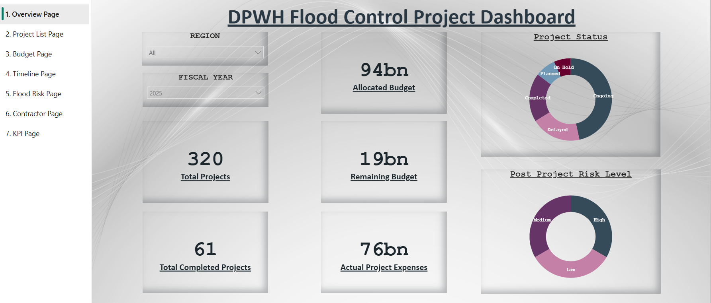
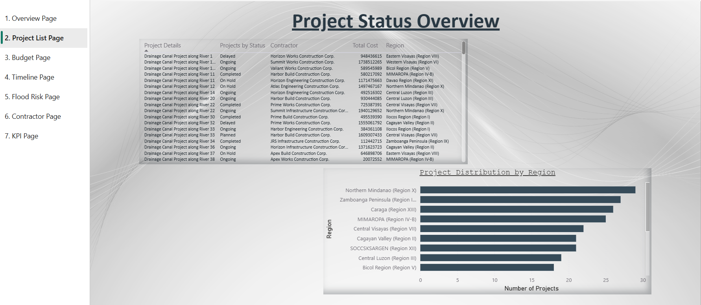
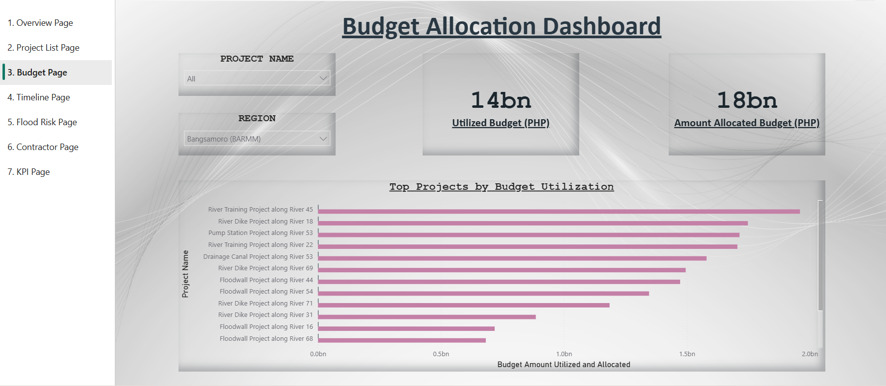
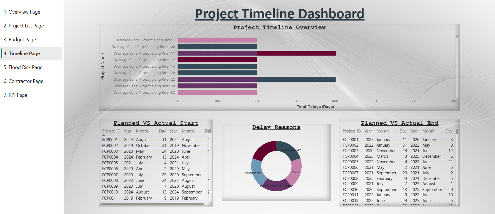
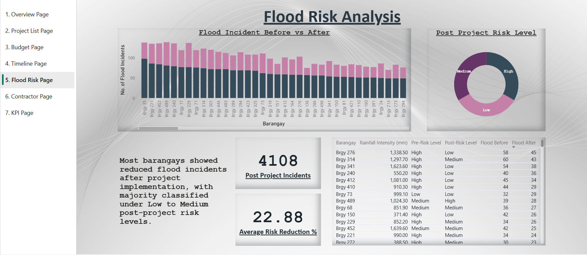

# DPWH Flood Control Dashboard

A multi-page Power BI dashboard project focused on flood control project monitoring and analysis.

## Features
- Project KPI Monitoring
- Budget Allocation Analysis
- Project Timeline Tracking
- Flood Risk Analysis
- Contractor Performance Monitoring

## Tools Used
- Power BI
- Power Query
- DAX
- Excel Dataset

## Dashboard Preview

### Overview Dashboard

### Project Status Overview

### Budget Dashboard

### Project Timeline Dashboard

### Flood Risk Analysis

### Contractor Performance Dashboard

### KPI Overview

## Power BI Report Link
[View Interactive Dashboard](https://app.powerbi.com/groups/me/reports/4dd27333-585b-4378-8202-eb73930e9ab6/ac2580c243dd8260cb6b?experience=power-bi)

## Project File
The `.pbix` file is included in this repository.
