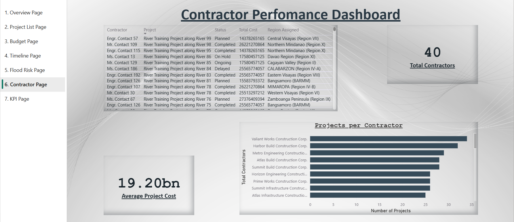
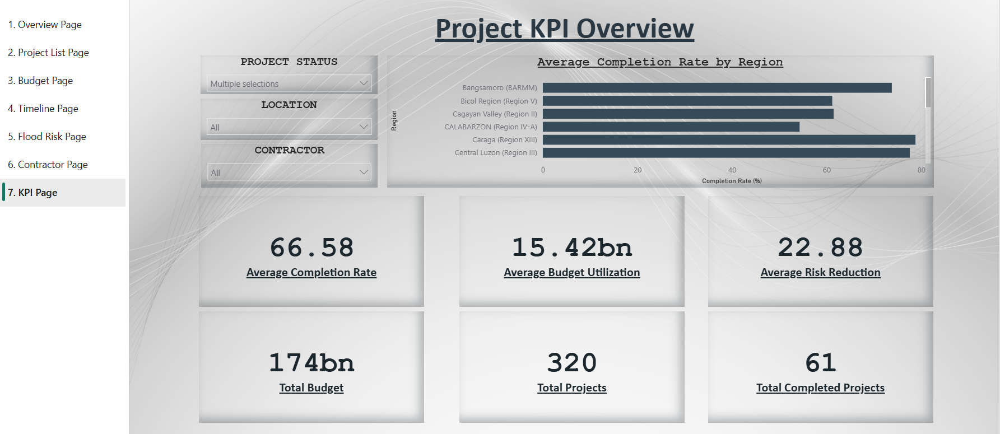

# DPWH Flood Control Dashboard

A multi-page Power BI dashboard project focused on flood control project monitoring and analysis.

## Features
- KPI Monitoring
- Budget Allocation Analysis
- Project Timeline Tracking
- Flood Risk Assessment
- Contractor Performance Analysis
- Interactive Slicers and Visualizations

## Tools Used
- Power BI
- Power Query
- DAX
- Excel Dataset

## Dashboard Pages
1. Overview Page
2. Project Status Overview
3. Budget Allocation Dashboard
4. Project Timeline Dashboard
5. Flood Risk Analysis
6. Contractor Performance Dashboard
7. KPI Overview

## Project Preview

### Overview Dashboard

### Project Status Overview

### Budget Allocation Dashboard

### Project Timeline Dashboard

### Flood Risk Analysis

### Contractor Performance Dashboard

### KPI Overview

